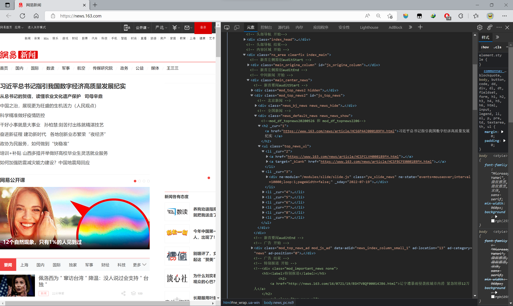

# Web期末项目汇报

**by 吴陆盟 10205501460**

****

## 简介

本项目实现了以下内容：

* 爬取了**网易新闻、新浪新闻、东方财富、财经网**四家新闻网站的新闻**855**条（截止写文档时）
* 实现了一个的**electron应用**，具有**查询爬取的新闻**和**分析所查关键词的时间热度**的功能

## 技术栈

* 爬虫部分：`Node.js`
* 应用部分：`Vue3`+`Node.js`+`Electron`+`MySQl`+`Express`

## 爬虫部分——以网易新闻为例

### 网站结构分析

#### 首页结构分析

> 通过观察网页结构，不难发现新闻网页的`url`格式均为`https://www.163.com/news/article/xxx.html`。
>
> 因此在爬虫时需要使用相应的正则表达式去匹配。即`^https:\/\/www.163.com\/news\/article\/.*?html$`。




#### 新闻页面分析

>  在找到所要解析的元素的标签类型后，就可以匹配对应的表达式，在爬取html后进行解析

* 标题

  * `class="post_title"`的文字
  * 

* 正文

  * `class="post_body"`的文字
  * 

* 关键词

  * `<meta name="keywords">`的`content`属性
  * 

* 发布时间

  * `<html>`的`data-publishtime`属性
  * 

* 作者

  * `class="post_author"`的文字

    

* 摘要
  * `<meta name="description"`的`content`属性
  * 

### 爬虫过程

> 注：爬虫脚本在`crawl`文件夹下。

#### 筛选新闻页面链接

```js
let source_name = "网易新闻";
let myEncoding = "utf-8";
let seedURL = 'https://news.163.com/';//主页url
let myURL = "";
let seedURL_format = "$('*')";

var mysql = require('./mysql.js')

let myRequest = require('request'); //发请求
let myCheerio = require('cheerio'); // 解析Jquery对象
let myIconv = require('iconv-lite');
let superagent = require('superagent'); 
require('date-utils'); 

// 防屏蔽爬虫
let headers = {
    'user-agent': "user-agent: Mozilla/5.0 (Windows NT 10.0; Win64; x64) AppleWebKit/537.36 (KHTML, like Gecko) Chrome/89.0.4389.128 Safari/537.36"
};

function request(url, callback) {
    let options = {
        url: url,
        encoding: null,
        headers: headers,
        timeout: 10000
    }
    myRequest(options, callback);
}

request(seedURL, function(err, res, body) {
    let html = myIconv.decode(body, myEncoding);
    let $ = myCheerio.load(html, {decodeEntities: true});
    let seedurl_news;
    try {
        seedurl_news = eval(seedURL_format);
        //console.log(seedurl_news)
    } catch(e) {console.log('url列表所处的html模块识别出错' + e)};
    seedurl_news.each(function(i, e) {
        try {
            let href = "";
            href = $(e).attr("href");
            if (typeof href == "undefined") {
                return;
            }
            if (
                /*匹配正则表达式以筛选新闻页面*/
                href.match(/^https:\/\/www.163.com\/news\/article\/.*?html$/)
                ){
                    var myURL = href;
                }
        }  catch (e) {console.log(e)}

        /*在数据库中检查是否之前已经爬取过*/
        var fetch_url_Sql = 'select url from fetches where url=?';
            var fetch_url_Sql_Params = [myURL];
            mysql.query(fetch_url_Sql, fetch_url_Sql_Params, function(qerr, vals, fields) {
                if (vals.length > 0) {
                    console.log('URL duplicate!');
                    return;
                } else if(myURL!=null){
                    /*如果没有爬取过则爬取*/
                    newsGet(myURL);
                }
            });
        
        })
    });
```

#### 解析新闻页面并存储结构化信息

```js

function newsGet(myURL) {    
    superagent.get(encodeURI(myURL)).end((err, res) => {
        if (err) {
            console.log("err");
        } else {
            console.log("爬取新闻成功!");
            getHotNews(res, myURL);
        }
    })
}
// 提取html代码中所需信息存入fetch对象中存入MySQL中
function getHotNews(res, myURL) {
    let $ = myCheerio.load(res.text, { decodeEntities: true });
    let fetch = {};
    fetch.title = "";
    fetch.content = "";
    fetch.keywords = "";
    fetch.publish_date = "";
    fetch.author = "";
    fetch.desc = "";
    fetch.source_name = source_name;
    fetch.source_encoding = myEncoding;
    fetch.crawltime = new Date;
    fetch.url = myURL;

    /*正则表达式匹配*/
    fetch.title = $('.post_title').eq(0).text();
    if ($('head').children('title').text().indexOf("谈心社")!=-1) return;

    fetch.content = $(".post_body").eq(0).text().replace(/\s*/g,"");

    fetch.keywords = $('meta[name=\"keywords\"]').eq(0).attr("content");

    fetch.publish_date = $('html').eq(0).attr('data-publishtime');

    fetch.author = $('.post_author').eq(0).text().replace(/\s*/g,"");

    fetch.desc = $('meta[name=\"description\"]').eq(0).attr("content");

    /*将结果存入MySQL*/
    var fetchAddSql = 'INSERT INTO fetches(url,source_name,source_encoding,title,' +
    'keywords,author,publish_date,crawltime,content) VALUES(?,?,?,?,?,?,?,?,?)';
    var fetchAddSql_Params = [fetch.url, fetch.source_name, fetch.source_encoding,
        fetch.title, fetch.keywords, fetch.author, fetch.publish_date,
        fetch.crawltime.toFormat("YYYY-MM-DD HH24:MI:SS"), fetch.content
    ];
    mysql.query(fetchAddSql, fetchAddSql_Params, function(qerr, vals, fields) {
        if (qerr) {
            console.log(qerr);
        }
    }); 
};
```

### 爬虫结果


## 应用部分

### 运行

#### 安装依赖

```js
yarn
```

#### 服务器

```js
cd /src/server
node index.js
```

#### electron应用

```js
yarn electron:serve
```

### 目录结构一览

> 无关或次要文件（夹）已折叠或隐去

```
|-- Myfinal
    |-- .gitignore
    |-- babel.config.js
    |-- package.json //node项目配置文件
    |-- README.md
    |-- vue.config.js//vue配置文件
    |-- yarn.lock
    |-- dist_electron
    |-- public  
    |-- src
        |-- App.vue //根组件
        |-- background.js //主进程
        |-- main.js //入口文件
        |-- renderer.js //渲染进程
        |-- assets //静态文件
        |   |-- logo.png
        |-- components //组件
        |   |-- header-padding.vue //每个子路由顶部填充，防止元素被顶栏遮住
        |-- router //存放路由，实现界面跳转
        |   |-- index.js
        |-- server //服务器
        |   |-- index.js
        |   |-- mysql.js
        |-- views //界面组件
            |-- Main.vue // 根路由，实现了侧边栏、顶栏和子路由页面的排版
            |-- home //新闻速览界面
            |   |-- index.vue 
            |-- keyword //关键字热度分析界面
            |   |-- index.vue
            |-- newsDetail //新闻详情界面
            |   |-- index.vue
            |-- search //搜寻界面
                |-- index.vue

```

### 前端

#### 页面总体结构

##### 页面路由

> `Main`有四个子路由，分别是新闻速览、搜寻、新闻详情和关键词热度分析

```js
/* router/index.js */
import { createWebHistory, createRouter } from "vue-router";
import Main from "@/views/Main.vue";
const routes = [
  {
    path: "/",
    name: "Main",
    component: Main,
    redirect:'/home',
    children:[
      {
        path:"/home",
        name:'home',
        component:()=>import("../views/home"),//新闻速览
      },
      {
        path:"/search",
        name:'search',
        component:()=>import("../views/search"),//搜寻
      },
      {
        path:"/newsDetail",
        name:'newsDetail',
        component:()=>import("../views/newsDetail"),//新闻详情
      },
      {
        path:"/keyword",
        name:'keyword',
        component:()=>import("../views/keyword"),//关键词热度分析
      }

    ]
  }, 
];

const router = createRouter({
  history: createWebHistory(),
  routes,
});

export default router;
```

##### 页面排版结构


> 在`Main.vue`中可以发现，页面由侧边栏、顶栏和子路由页面构成。
>
> 在进行路由跳转时，侧边栏和顶栏不会重新渲染。
>
> 

#### 侧边栏

> 可进行新闻速览和搜寻页面的切换。
>
> 鼠标悬浮或选中时相应按钮颜色会变黑。


#### 顶栏

> 可进行历史页面的切换和最大/小化或关闭窗口。
>
> 切换历史页面：按钮`@click="this.$router.go(-1/1)"`
>
> 最大/小化或关闭窗口：主进程和渲染进程的进程间通信，稍后在`Electron`部分解释


#### 新闻速览页面

> 随机选取18条新闻显示。可以通过刷新按钮换一批新闻显示。
>
> 鼠标悬浮新闻时会反色强调，点击可以切换至相应新闻的新闻详情页面。


#### 搜寻页面

> 通过关键字搜寻新闻。默认从标题和内容里做like搜索。可指定仅搜寻内容或标题。
>
> 可搜索关键词热度，这将跳转至关键词热度分析页面。
>
> 鼠标悬浮新闻时会反色强调，点击可以切换至相应新闻的新闻详情页面。
>
> 若无搜寻结果，显示”空空如也“。


#### 新闻详情页面

> 显示爬取的结构化信息。
>
> 鼠标悬浮关键词时会反色强调，点击可以切换至相应的关键词热度分析页面。


#### 关键词热度分析页面

> 可以查看关键词在历史上的出现次数。
>
> 可以查看包含该关键词的新闻。
>
> 鼠标悬浮新闻时会反色强调，点击可以切换至相应新闻的新闻详情页面。
>
> 使用`echarts`绘图。
>
> 可以通过调整柱形图下方的横条宽度查看局部数据，以解决无法完整显示每天日期的问题。
>
> 考虑到`vue`的生命周期特点和`echarts`必须在`dom`生成后初始化，所以将数据设定的部分放在该组件的`mounted()`钩子中，而`created()`钩子中存放获取数据的部分。


### 后端

#### 初始化

> 使用`Express`框架。

```js
var mysql = require('./mysql.js')
var express = require('express');
var app = express();

var server = app.listen(8082, function() {

    var host = server.address().address
    var port = server.address().port

    console.log("访问地址为 http://%s:%s", host, port)

})
```

#### 跨域问题

> 由于`javascript`安全限制的同源（主机名、协议和端口号的组合）策略，所以会产生跨域问题。为了方便开发，设置所有域名可访问后端。

```js
app.all('*', function (req, res, next) {
    //设置允许跨域的域名，*代表允许任意域名跨域
    res.header('Access-Control-Allow-Origin', '*')
    //允许的header类型
    res.header('Access-Control-Allow-Headers', 'content-type')
    //跨域允许的请求方式
    res.header('Access-Control-Allow-Methods', 'DELETE,PUT,POST,GET,OPTIONS')
    if (req.method.toLowerCase() == 'options') res.send(200)
    //让options尝试请求快速结束
    else next()
})
```

#### 新闻速览

> 随机排列后选取前18条记录。

```js
app.get('/home_news', function(request, response) {
    var fetchSql = "select id_fetches,source_name,title,publish_date " +
        "from fetches order by rand() limit 0,18";
    mysql.query(fetchSql, function(err, result, fields) {
        response.writeHead(200, {
            "Content-Type": "application/json"
        });
        response.write(JSON.stringify(result));
        response.end();
    });
});
```

#### 新闻详情

> 根据新闻的`id`（路由跳转时携带的参数）查询。

```js
app.get('/newsDetail', function(request, response) {
    var id = request.query.id;
    var fetchSql = "select id_fetches,source_name,title,publish_date,content,author,keywords  " +
        "from fetches where id_fetches ="+id;
    mysql.query(fetchSql, function(err, result, fields) {
        response.writeHead(200, {
            "Content-Type": "application/json"
        });
        response.write(JSON.stringify(result));
        response.end();
    });
});
```

#### 搜寻

> 根据关键词（以及设置的搜索范围限制）搜索新闻。

```js
app.get('/search', function(request, response) {
    var selected = request.query.selected;
    var text = request.query.text;
    var type;
    var fetchSql
    if(selected=="搜寻内容")
    {
        fetchSql = "select id_fetches,source_name,title,publish_date,author  " +
        "from fetches where content like "+"\"%"+text+"%\"";
    }
    else if(selected=="搜寻标题"){
        fetchSql = "select id_fetches,source_name,title,publish_date,author  " +
        "from fetches where title like "+"\"%"+text+"%\"";
    }
    else{
        fetchSql = "select id_fetches,source_name,title,publish_date,author  " +
        "from fetches where title like "+"\"%"+text+"%\" or content like "+"\"%"+text+"%\"";
    }

    mysql.query(fetchSql, function(err, result, fields) {
    response.writeHead(200, {
        "Content-Type": "application/json"
    });
    response.write(JSON.stringify(result));
    response.end();
    });
});
```

#### 关键字热度查询

>  搜索指定关键字在每天出现的次数，然后将搜索结果按日期升序排列。

```js
app.get('/keyword', function(request, response) {
    var keyword = request.query.keyword;    
    var fetchSql = "select count(id_fetches) countNum, DATE(publish_date) date " +
        "from fetches where content like "+"\"%"+keyword+"%\" or title like "+"\"%"+keyword+"%\""
        +"GROUP BY DATE(publish_date) ORDER BY DATE(publish_date) ASC";
    try{
        mysql.query(fetchSql, function(err, result, fields) {
        console.log(result);
        response.writeHead(200, {
            "Content-Type": "application/json"
        });
        response.write(JSON.stringify(result));
        response.end();
        });
    }catch(e){
        console.log(e)
    }
});
```

### Electron

> `Electron`中，主进程运行`package.json`的main脚本的进程，主进程中的脚本创建web页面，且web页面运行在渲染进程中。主进程和渲染进程可以相互通信。为了实现最大/小化以及关闭按钮，需要在渲染进程中通过`ipcRender`给主进程发送信息，主进程收到相应消息后执行相应操作。

#### 主进程

```js
import { app, protocol, BrowserWindow } from 'electron'
import { createProtocol } from 'vue-cli-plugin-electron-builder/lib'
import installExtension, { VUEJS3_DEVTOOLS } from 'electron-devtools-installer'
const isDevelopment = process.env.NODE_ENV !== 'production'
import { ipcMain } from 'electron'

// Scheme must be registered before the app is ready
protocol.registerSchemesAsPrivileged([
  { scheme: 'app', privileges: { secure: true, standard: true } }
])

async function createWindow() {
  // Create the browser window.
  const win = new BrowserWindow({
 
    minWidth:800,
    minHeight:600,
    frame:false,//去掉系统顶栏
    resizable:true,
    webPreferences: {
      
      // Use pluginOptions.nodeIntegration, leave this alone
      // See nklayman.github.io/vue-cli-plugin-electron-builder/guide/security.html#node-integration for more info
      nodeIntegration: process.env.ELECTRON_NODE_INTEGRATION,
      contextIsolation: !process.env.ELECTRON_NODE_INTEGRATION
    }
  })
 
  if (process.env.WEBPACK_DEV_SERVER_URL) {
    // Load the url of the dev server if in development mode
    await win.loadURL(process.env.WEBPACK_DEV_SERVER_URL)
    //if (!process.env.IS_TEST) win.webContents.openDevTools()
  } else {
    createProtocol('app')
    // Load the index.html when not in development
    win.loadURL('app://./index.html')
  }
  //最小化
  ipcMain.on('window-min',function(){ 
    win.minimize();
  })

  //最大化、恢复
  ipcMain.on('window-max',function () {
    if(win.isMaximized()){ // 为true表示窗口已最大化
      win.restore();// 将窗口恢复为之前的状态.
    }else{
      win.maximize();
    }
  })

  // 关闭
  ipcMain.on('window-close',function (){
    win.close();
  })
}
 
// Quit when all windows are closed.
app.on('window-all-closed', () => {
  // On macOS it is common for applications and their menu bar
  // to stay active until the user quits explicitly with Cmd + Q
  if (process.platform !== 'darwin') {
    app.quit()
  }
})
 
app.on('activate', () => {
  // On macOS it's common to re-create a window in the app when the
  // dock icon is clicked and there are no other windows open.
  if (BrowserWindow.getAllWindows().length === 0) createWindow()
})
 
// This method will be called when Electron has finished
// initialization and is ready to create browser windows.
// Some APIs can only be used after this event occurs.
app.on('ready', async () => {
  if (isDevelopment && !process.env.IS_TEST) {
    // Install Vue Devtools
    try {
      await installExtension(VUEJS3_DEVTOOLS)
    } catch (e) {
      console.error('Vue Devtools failed to install:', e.toString())
    }
  }
  createWindow()
})
 
// Exit cleanly on request from parent process in development mode.
if (isDevelopment) {
  if (process.platform === 'win32') {
    process.on('message', (data) => {
      if (data === 'graceful-exit') {
        app.quit()
      }
    })
  } else {
    process.on('SIGTERM', () => {
      app.quit()
    })
  } 
}
```

#### 渲染进程

```vue
/*Main.vue节选*/
<template>
    <p  class="right-top-btn" @click="minimizeWin()">—</p>
    <p  class="right-top-btn" @click="maximizeWin()">▢</p>
    <p  class="right-top-btn" @click="closeWin()">✕</p>
</template>

<script>
    import { ipcRenderer} from 'electron';
	export default{
          methods:{
              minimizeWin(){
                  ipcRenderer.send('window-min') // 通知主进程我要进行窗口最小化操作
              },
              maximizeWin(){
                  ipcRenderer.send('window-max')
              },
              closeWin(){
                  ipcRenderer.send('window-close')
              }
         }
    }
</script>
```

## 总结

在本项目中，我熟悉了`Node.js`的异步函数并进行了爬虫、熟悉了`Vue`、`Electron`等框架，实现了前端、后端、数据库的互通，极大地锻炼了我的项目能力。
